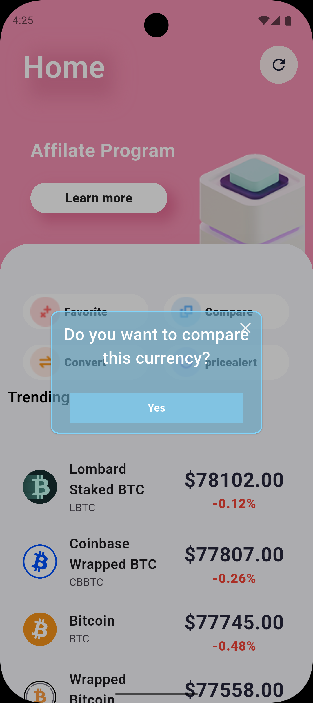
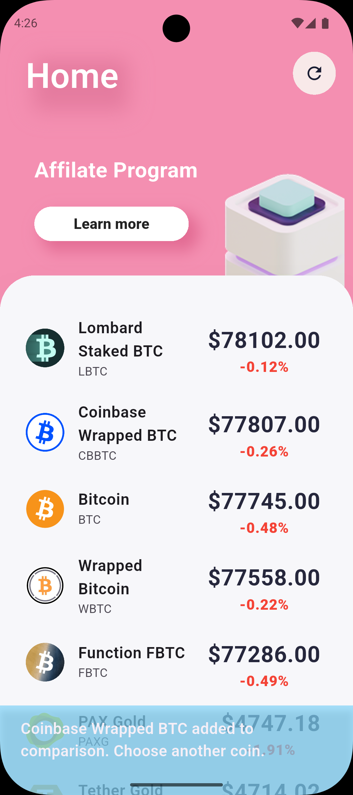
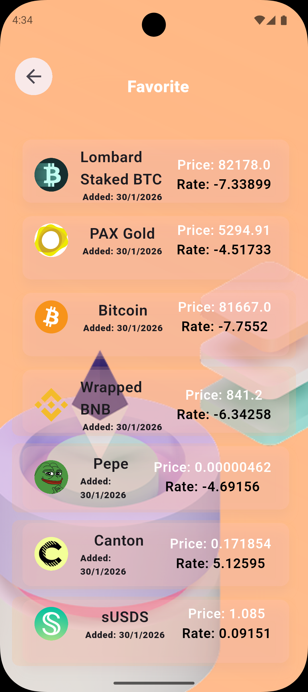
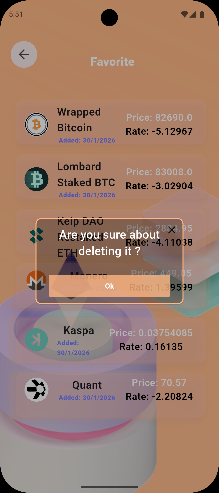
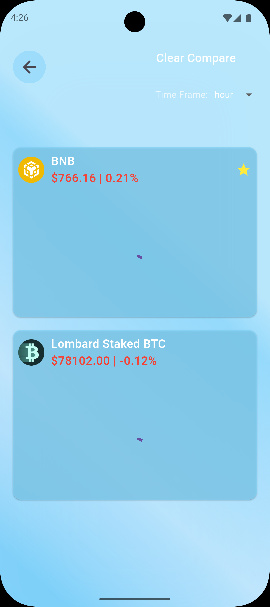
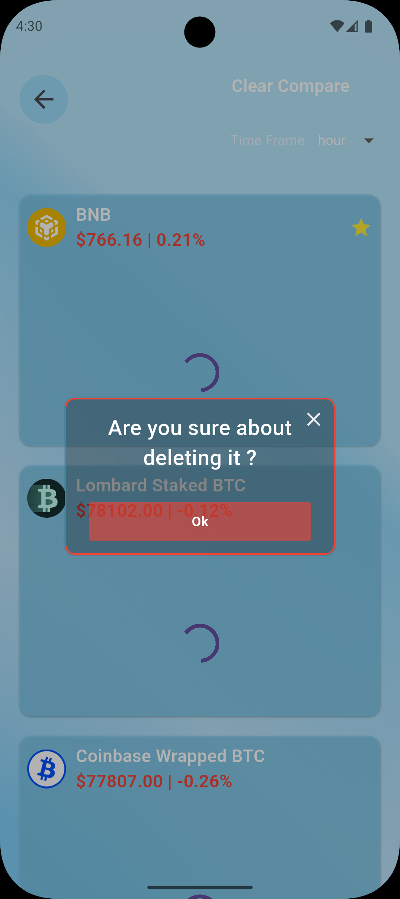

# 🎉 CoinExa - Cryptocurrency App

**CoinExa** is a modern Flutter application for tracking, converting, and analyzing cryptocurrency prices in real-time.  
The app focuses on clean architecture, smooth user experience, and efficient performance.  
It also uses **Hive** for local storage to save favorite coins and user data offline.

---

## 🌟 Features

- 💰 **Real-time Cryptocurrency Prices**  
  Fetch live prices using the CoinGecko API.

- 🔄 **Coin Converter**  
  Convert between different cryptocurrencies easily.

- ⭐ **Favorite Coins (Local Storage)**  
  Save favorite coins with their **price and percentage change at a specific time** using Hive.

- ⚖️ **Compare Cryptocurrencies**  
  Compare prices and performance of multiple cryptocurrencies to analyze differences and trends.

- 📈 **Price Change Indicators**  
  Track price movements and percentage changes over time.

- 📊 **Detailed Charts**  
  View price history with multiple time ranges (1H, 1D, 1W, 1M, 1Y).

- ⚡ **High Performance**  
  Optimized API calls and efficient state management.

- 🏗️ **Clean Architecture**  
  Built using **BLoC** for state management and **MVVM** for scalable, maintainable code.

- 🗄️ **Offline Support**  
  Access favorite coins even without an internet connection.

---

## 🖼️ Screenshots

### Home Screen




### Convert Coins


### Favorite Coins



### Coin Details


### Compare Screen



---

## 🛠 Tech Stack

- Flutter (Dart)
- BLoC (State Management)
- MVVM Architecture
- Dio (HTTP Requests)
- Hive (Local Storage)
- CoinGecko API
- Charts & Data Visualization
- flutter_launcher_icons (Custom App Icon)


---

## ⚡ Installation

1. Clone the repository:
```bash
git clone https://github.com/zeyad-nour/coinexa_app.git
cd coinexa_app
