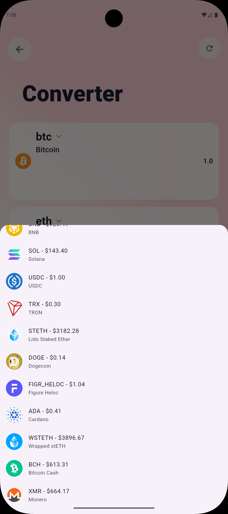
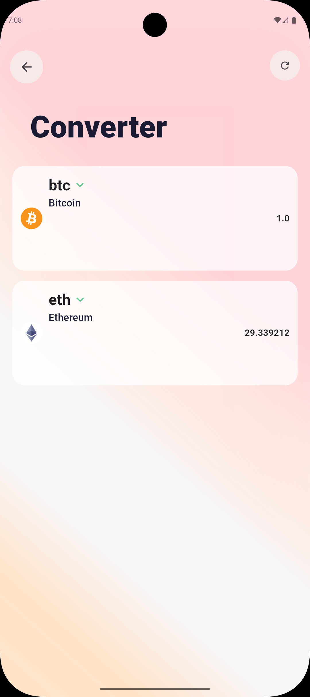
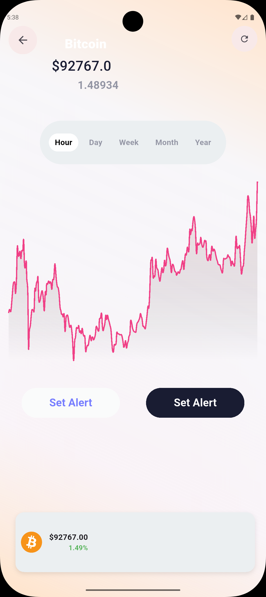

# 🎉 CoinExa - Cryptocurrency App

**CoinExa** is a **preliminary version** of a modern Flutter application for tracking, converting, and analyzing cryptocurrency prices in real-time.  
_New features and improvements will be implemented in future updates!_

---

## 🌟 Features

<div style="background-color:#f5f5f5; padding: 10px; border-radius: 8px;">

- 💰 **Real-time Price Updates** – Instant updates using [CoinGecko API](https://api.coingecko.com/api/v3/)  
- 🔄 **Coin Converter** – Easily convert between different cryptocurrencies  
- 📈 **Track Prices & Profit Indicators** – Monitor price changes and profit trends  
- 🔮 **Predictive Algorithm** – Short-term price predictions for the next few hours  
- 📊 **Detailed Charts** – Daily, weekly, monthly, and yearly price trends  
- ⚡ **High Performance** – Optimized for minimal memory and CPU usage  
- 🏗️ **Architecture** – Built using **BLoC** for state management & **MVVM** pattern for clean code  

</div>

---

## 🖼️ Screenshots

### Home Screen
<div style="background-color:#f5f5f5; padding: 10px; border-radius: 8px; text-align:center;">

</div>

### Convert Coins
<div style="background-color:#f5f5f5; padding: 10px; border-radius: 8px; text-align:center;">


</div>

### Coin Details
<div style="background-color:#f5f5f5; padding: 10px; border-radius: 8px; text-align:center;">

</div>

---

## ⚡ Installation

1. Clone the repository:

```bash
git clone https://github.com/zeyad-nour/coinexa_app.git
